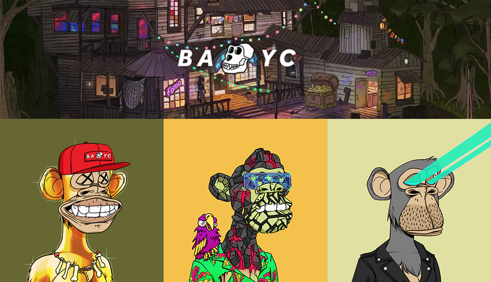

# Bored Ape Yacht Club Subgraph / API



This is a subgraph that enables the indexing and querying of data from the Bored Ape Yacht Club and Mutant Ape Yacht Club NFTs / smart contracts using [The Graph](https://thegraph.com/)

### Using the subgraph

The subgraph is located in the Graph Explorer at [https://thegraph.com/legacy-explorer/subgraph/dabit3/boredapeyachtclub](https://thegraph.com/legacy-explorer/subgraph/dabit3/boredapeyachtclub).

You can use it in your app by accessing this API endpoint:

```markdown
https://api.thegraph.com/subgraphs/id/QmaQReZYZ7J6ergVLhmZFTrd7AenV46aJ8c2Y6ohdJ3Dbp
```

To learn how to query a subgraph with GraphQL, check out the docs [here](https://thegraph.com/docs/developer/querying-from-your-app)

### Deploying your own version of the subgraph

First, clone the project:

```sh
git clone git@github.com:dabit3/bored-ape-yacht-club-api-and-subgraph.git
```

Next, change into the new directory and install the dependencies:

```sh
cd bored-ape-yacht-club-api-and-subgraph

npm install
```

Create an account on The Graph [here](https://thegraph.com/legacy-explorer/dashboard).

Next, create a new subgraph in the Graph Hosted Service [here](https://thegraph.com/legacy-explorer/subgraph/create?account=All%20Subgraphs)

Before deploying, you need to first authenticate via the Graph CLI using the access token given to you in your account:

```sh
graph auth --product hosted-service <ACCESS_TOKEN>
```

Next, either update the code that you have, or deploy as is, updating the username and subgraph name with your own username + subgraph name:

```sh
graph deploy --product hosted-service <username/subgraph-name>
```

For instance, my deploy script will look like this:

```sh
graph deploy --product hosted-service dabit3/boredapeyachtclub
```

### Working with IPFS in a subgraph

This project can also serve as a useful reference for how to query IPFS from within a subgraph mapping template, using methods like `ipfs.cat` from the [`graph-ts`](https://github.com/graphprotocol/graph-ts) library and how to manage the data once it comes back from IPFS:

```javascript
let data = ipfs.cat(ipfshash)

let value = json.fromBytes(data!).toObject()

let attributes = value.get('attributes').toArray()

for (let i = 0; i < attributes.length; i++) {
  let item = attributes[i].toObject()
  // do stuff
}
```